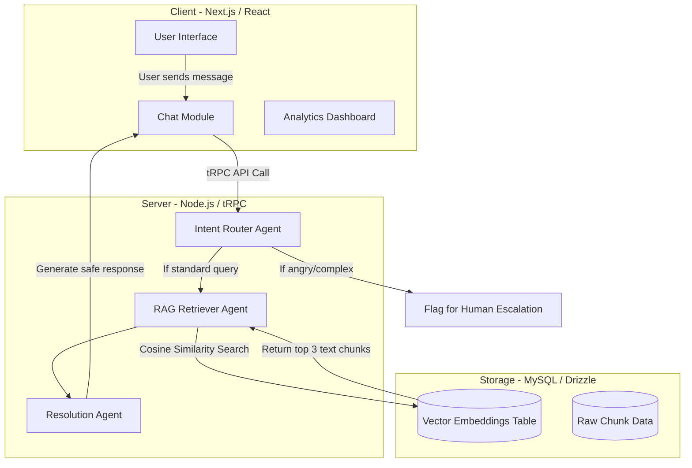

# ⚙️ SupportFlow : Enterprise Multi-Agent AI Customer Support Assistant Platform using RAG and LLMs

An advanced, Multi-Agent Customer Support platform built to demonstrate how advanced Large Language Models (LLMs) and Retrieval-Augmented Generation (RAG) can revolutionize customer service. 

Instead of relying on rigid, frustrating decision trees ("Press 1 for Billing"), SupportFlow uses autonomous AI agents to read natural language, understand the user's intent, search a proprietary company knowledge base, and generate helpful, accurate responses—while knowing exactly when to step back and escalate to a human.

Designed with a sleek, minimalist aesthetic, It seamlessly handles everything from generic FAQs to technical troubleshooting, smartly escalating complex issues to human agents when necessary.

The system uses a Multi-Agent architecture to route queries, retrieve proprietary company policies via a Vector Database, and generate accurate, zero-hallucination responses while automatically escalating complex or angry interactions to a human dashboard.


---

🌐 **Live Demo :**  https://multi-agent-ai-yrbu.onrender.com 

--- 

## Problem Statement ❓

Companies receive thousands of customer queries every day. A single chatbot often struggles to
answer questions from different domains such as billing, technical support, product informa;on, and
complaints.

---

## Project Objective ✨
Design and develop a web-based AI-powered customer support assistant capable of answering
customer queries using multiple specialized AI agents.

Unlike a normal chatbot, this system should :
• Understand customer intent
• Route the request to the correct AI agent
• Retrieve relevant company informa;on
• Generate accurate responses
• Maintain conversa;on history
• Escalate unresolved issues

---

## 📸 Screenshots

### Platform Interface 


### Agent & Guide 


### Homepage Interface 


### Customer Chat Interface


### Dashboard


### RAG Knowledge Ingestion


### Human Escalation Dashboard


---

## 🌟 Features

### 🤖 Multi-Agent Orchestration
- Separate specialized AI sub-agents for Intent Routing, Context Retrieval, and Query Resolution.
- Zero-hallucination constraints
- Intelligent routing based on query context
- Tasks are divided between specialized AI agents. One routes, one retrieves, and one synthesizes the final answer.

### 🎯 Intent Router Agent
- The system doesn't just guess; an autonomous "Router Agent" analyzes every incoming message to classify it (e.g., Shipping, Billing, Technical, Escalation).
- Analyzes user emotional tone and intent
- Categorizes messages (`GENERAL_CHAT`, `RAG_QUERY`, `ESCALATE`)
- Employs Few-Shot Prompting for precise classification
- If a customer is furious or has an edge-case problem, the AI immediately flags the chat and moves it to a dedicated "Escalations" dashboard for a human manager to take over.

### 📚 RAG Context Retriever
- The AI answers questions based *strictly* on uploaded company documents. It extracts semantic meaning via Vector Embeddings, ensuring it never hallucinates fake policies.
- Automatically determines if a query is billing, technical, shipping, or an escalation.
- Reads proprietary company PDFs (TechMart Data)
- Generates 768-D Vector Embeddings
- Executes Cosine Distance searches against a Vector DB

### 🛡️ Safety & Escalation Mechanisms
- Detects profanity and legal threats
- Bypasses AI generation for high-risk queries
- Built top-to-bottom with TypeScript, tRPC, Zod, and Drizzle ORM.
- Flags tickets immediately to the Human Dashboard

### 📊 Modern, Minimalist Analytics Dashboard 
- A beautiful, responsive frontend inspired by premium consumer apps (utilizing a stark `#ffffff` and `#222222` contrast with a vibrant `#ff385c` action color).
- Live chat monitoring
- Built-in charts tracking AI resolution rates vs. Human intervention rates.
- Sleek, premium user interface

---


## 🧠 How It Works

```text
User Query via Next.js Client
            ↓
tRPC Secure API Route
            ↓
Intent Router Agent (Classification)
            ↓
(If RAG_QUERY) Context Retriever Agent
            ↓
MySQL Vector Database Search (Cosine Similarity)
            ↓
Resolution Synthesizer Agent
            ↓
Instant Markdown Response to Client
```

---

## 🏛️ System Architecture Workflow



---

## 🛠️ Technologies Used

*   **Frontend Framework :** Next.js 14 (App Router)
*   **UI Library :** React 18, Tailwind CSS, Lucide React (Icons), Recharts (Data Visualization)
*   **API Layer :** tRPC (for end-to-end type safety)
*   **Backend Runtime :** Node.js
*   **Database :** MySQL (managed via Drizzle ORM). Chosen specifically for its robust vector search capabilities.
*   **AI Models :** Google Gemini 3.1 Pro (for Agent Reasoning) and Google Gemini Text Embeddings (for Vectorization)
*   **Data Processing :** `pdf-parse` for automated document extraction.

---

## 📂 Project Structure

```text
Multi-Agent-AI/
│
├── server/
│   ├── _core/
│   │   ├── index.ts         ← Main Node/Express Server
│   │   └── oauth.ts         ← Authentication Logic
│   ├── agents.ts            ← The Multi-Agent Cognitive Engine
│   └── routers.ts           ← tRPC API Routes
│
├── client/
│   ├── pages/               ← Next.js Frontend Routes
│   └── components/          ← Reusable React UI Components
│
├── scripts/
│   └── ingest_kb.ts         ← Document Ingestion & Vectorization Script
│
├── knowledge_base/          ← Proprietary PDF Documents (TechMart)
│
├── drizzle/
│   └── schema.ts            ← MySQL Database & Vector Definitions
│
├── package.json
└── drizzle.config.ts
```

---

## 📊 Dataset & Knowledge Base Explanation

1.  **Intent Classification Dataset :** The AI's routing logic is grounded in the structural concepts of the **Bitext Customer Support Dataset** and **Banking77**. I designed the Intent Agent to recognize standard support patterns found in these benchmarks. A sample dataset (`datasets/intent_classification_samples.csv`) is provided in this repository to demonstrate the mapping logic.
2.  **The Knowledge Base (RAG Dataset):** I intentionally **did not** use a public dataset for the knowledge base. Public conversational datasets cannot test a system's ability to ingest and recall *proprietary* company policies. Instead, I generated a comprehensive synthetic Knowledge Base for a fictional company named **"TechMart Electronics"**. This consists of 8 detailed PDFs (Shipping, Warranty, Refunds, etc.) located in the `knowledge_base/` folder. The RAG system ingests these PDFs, vectorizes them, and uses them to answer questions, proving the system is enterprise-ready.

---

## 🚀 Step-by-Step Installation Guide

Follow these instructions exactly to get the project running on your local machine.

### Step 1: Prerequisites
Ensure you have the following installed on your system:
*   **Node.js** (v18.x or higher)
*   **MySQL Server** (running locally on port `3307`, or modify `drizzle.config.ts` if running on default `3306`)
*   **Git**

### Step 2: Clone the Repository
```bash
git clone <your-github-repo-url>
cd multi-agent-ai
```

### Step 3: Install Dependencies
This project uses Node Package Manager (NPM).
```bash
npm install
```

### Step 4: Environment Configuration
Create a file named `.env` in the root folder of the project. Open it and add the following two lines. (Replace the Gemini key with your actual Google AI Studio API key).
```env
# Database configuration string
DATABASE_URL="mysql://root:@127.0.0.1:3307/multi_agent_ai"

# Google Gemini API Key
GEMINI_API_KEY="your_actual_api_key_here"
```

### Step 5: Database Setup & Knowledge Base Ingestion
First, we need to push our database schema (tables, columns) to the MySQL server using Drizzle.
```bash
npx drizzle-kit push
```
Next, we must ingest our company documents. This custom script reads all 8 PDFs in the `knowledge_base/` folder, splits them into semantic chunks, generates vectors via the Gemini API, and saves them to MySQL.
```bash
npx tsx scripts/ingest_kb.ts
```
*(Wait for the script to finish; it will log its progress as it embeds each document).*

### Step 6: Start the Application
Start the Next.js development server:
```bash
npm run dev
```
Open your web browser and navigate to `http://localhost:3000`.

---

## 🔍 How to Test the Application
Once the app is running, try the following scenarios in the Chat interface to see the Multi-Agent system in action :

1.  **Test the RAG Pipeline (Policy Query) :-**
    *   *Type :* "My screen is cracked, can I get a refund?"
    *   *Expected Result :* The AI will query the vector database, read the `Warranty.pdf` and `RefundPolicy.pdf`, and inform you that physical damage is only covered under the Premium Care tier.
2.  **Test the Intent Router (Escalation) :-**
    *   *Type :* "I am extremely angry, your product is garbage and I demand to speak to a manager immediately."
    *   *Expected Result :* The Intent Agent will recognize the aggressive tone and escalation intent, bypass the RAG system entirely, and inform you that a human agent has been notified. You can then view this flagged chat in the **Escalations** tab.

---

## 🔮 Future Enhancements

- Multi-Language Customer Support
- Real-Time Voice Transcription
- Integration with Zendesk/Salesforce
- Advanced Analytics Export
- Custom Fine-Tuned Embedding Models
- Sentiment analysis for routing frustrated customers
- Human-agent handoff
- Email and WhatsApp integration
- AI-generated conversation summaries
- Customer satisfaction feedback and analytics

---

## 🍀mLearning Outcomes
After completing this project, I was able to understand :
• Multi-Agent Systems
• Large Language Models (LLMs)
• Retrieval-Augmented Genera;on (RAG)
• Embedding Models
• Vector Databases
• REST APIs
• Full Stack Development
• Cloud Deployment

---

## 👤 Author

**Name**: ALVIRA PARVEEN  
🔗 [LinkedIn](https://www.linkedin.com/in/alvira-parveen-78022536b)  
🌐 [GitHub](https://github.com/Alvira-Parveen)

---

## 📄 License

This project is licensed under the MIT License — see the [LICENSE](LICENSE) file for details.

---
